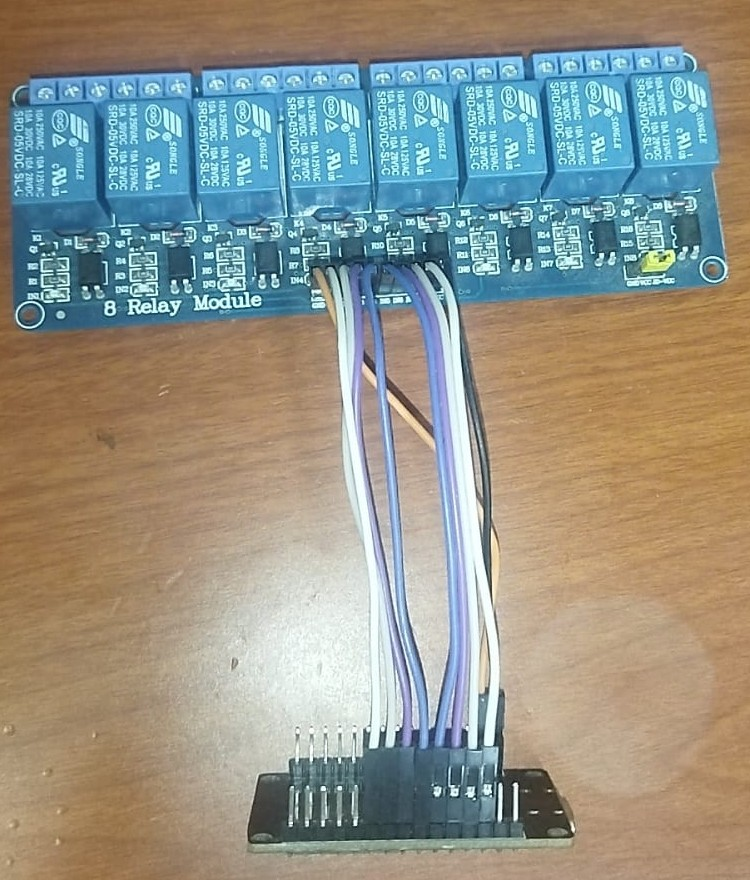

## Day 1 the start 5/7/2026
## **time tracked:**  6h
First i got an esp32 board because it has wifi and also got an 8 channel relay i connected VCC and GND between the arduino esp32 to test it i connected ln1, ln2, ln3, ln4 on the relay to pins 16, 4, 2, 15 on the arduino i started writing code and defining the ports i created a simple wesbite with an on and off button and it worked but the buttons were workingt backwards i noticed that all the relays worked as soon as the esp32 was powered on when i pressed the on button on the website the relays turned off i discovered that the relay module i was using was in active low mode in the setup function i set all the ports to high so that when the esp32 was powered on all the relay channels would be closed i changed high to low in the power commands and low to high in the power commands and then every worked.
.

## Day 2 
## **time tracked:**  8h
I started developing the website interface first I added background colors and then added buttons in boxes each box containing a name an on button and a stop button I added neon colors to the buttons with a hover effect so the button glows when the mouse hovers over it I modified the code to be mobile friendly so the buttons would automatically stack on top of each other I encountered a problem the page would refresh every time I turned a button on or off I added JavaScript code using fetch which made pressing a button send the request in the background without the user noticing any page refresh.

## Day 3 
## **time tracked:**  5h
I decided to add yhe remaining 4 channels to the relay i connected ln5,ln6,ln7,ln8 on the relay to 16,4,2,15 on the esp I changed ln1,ln2,ln3,ln4 in the relay to 19, 18, 5 ,17 in the ESP. then i modified the code to be able to control the new channels after testing the code everything worked well and decided to add a new feature automatically deativating the relays after a specified time period which the user defines. 
.
