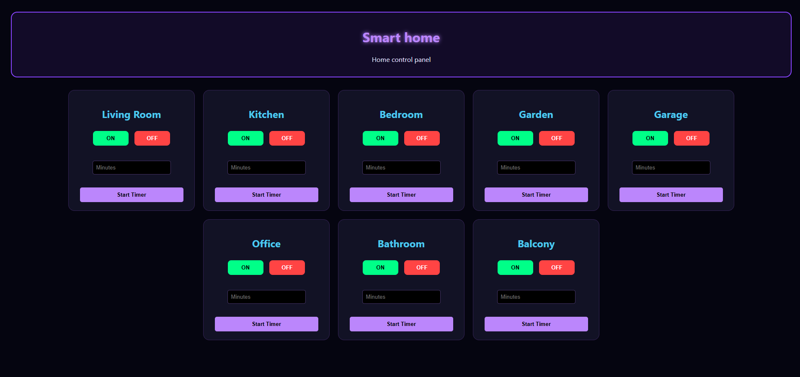
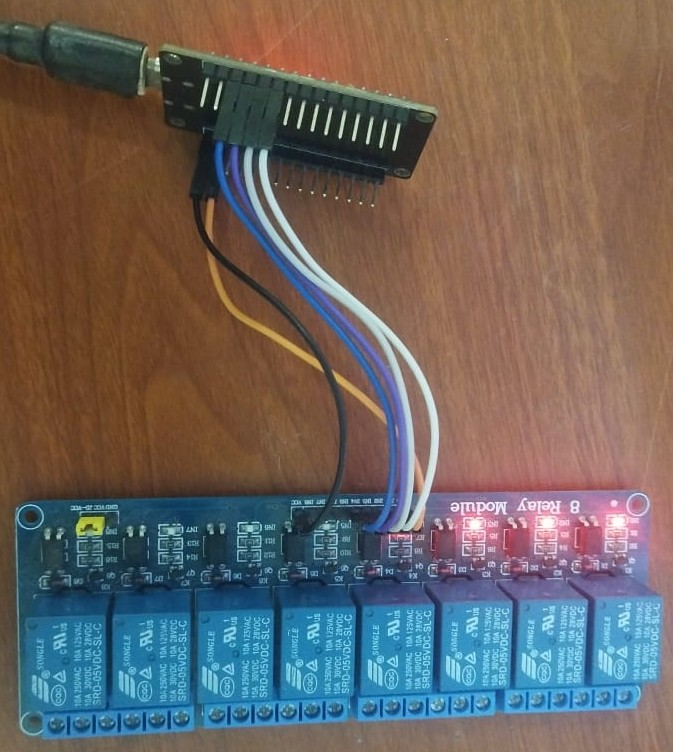

## SmartHome
A smart home is a device that allows you to control the home and anything connected to the relay.

## features
- neon designed web interface that runs smoothly on both computers and smartphones.
- Mobile app stacking support for easy verical rearrangement on mobile screens.
- background executing using java script fetch for instant execution without page reloading.
- timer system to automatically turn off the relay after a specified time.
- independent control of 8 relay channels.

## web interface

this wepsite controls the home and is connected to the esp32 it operates only on the local network using the esp ip address.

## Required components
1. esp32 board x1
2. relay 8 channel 5V x1
3. female to female jumper wires x8
5. USB-A to USB-C cable for programming and power supply x1

## Component purchase links
1. [ESP32](https://share.temu.com/SbDvANfAYtB)
2. [Relay 8 channel](https://share.temu.com/sZogn0PjtcB)
3. [famale to famale jumper wires](https://share.temu.com/9QQZqEVg8nB)
4. [USB-A to cable USB-C](https://share.temu.com/YKPuzVAg0hB)

## Wiring connections
|      |         |
|------|---------|
| D19  | Relay 1 |
| D18  | Relay 2 |
| D5   | Relay 3 |
| D17  | Relay 4 |
| D16  | Relay 5 |
| D4   | Relay 6 |
| D2   | Relay 7 |
| D15  | Relay 8 |
| GND  | GND     |
| VIN  | VCC     |

## Setup and operation
1. Download the Arduino IDE software for writing and modifying code.
2. All connections are included in the code.
3. The network name and password must be changed from the code.
4. After loading the code onto the ESP panel, open the serial monitor to obtain the IP address.
